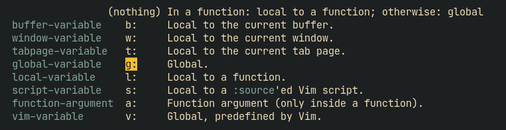

Vim variable scopes
-------------------


Some notable key shortcuts
--------------------------
<kbd>Ctrl</kbd>+<kbd>A</kbd>					increase the number(s)  
<kbd>Ctrl</kbd>+<kbd>X</kbd>					decrease the number(s)  

<kbd>Ctrl</kbd>+<kbd>E</kbd>					cursor-stationary UP  
<kbd>Ctrl</kbd>+<kbd>Y</kbd>					cursor-stationary DOWN

<kbd>Ctrl</kbd>+<kbd>W</kbd> <number> {<kbd><</kbd>,<kbd>></kbd>}		vertical-split resizing  
<kbd>Ctrl</kbd>+<kbd>W</kbd> <number> {<kbd>+</kbd>,<kbd>-</kbd>}		horizontal-split resizing

###### Visual mode
- <kbd>~</kbd> Swap case  
- <kbd>U</kbd> All UPPERCASE  
- <kbd>u</kbd> All lowercase

###### Normal mode
- `gU<motion>` UPPERCASE
- `gu<motion>` lowercase

For current character  => `<motion>` is <kbd>l</kbd>  
For previous character => `<motion>` is <kbd>h</kbd>


`<number> Ctrl-6`			Switch to buffer `<number>`

`zR`						Open all folds  
`zM`						Close all folds

<kbd>%</kbd>							Move to corresponding bracket


Some useful commands
-------------------
Test all highlight groups
```vim
so $VIMRUNTIME/syntax/hitest.vim
```

Echo the highlight group of the character under cursor
```vim
echo synIDattr(synID(line("."), col("."), 1), "name")
```

How to goto specific LineNumber
-------------------------------
 `:123<CR>`  
 `123G`  
 `123gg`

 Or, you can simply do `123 <Enter>` using this -
```vim
nnoremap <CR> G
```


Useful word motions
--------------
 `UPPERCASE` => word is anything between whitespace  
 `lowercase` => word is also delimited by `:,\.`

| Motion | For  |
|--------|---------|
| `b` `B`	|	Prev word  |
| `w` `W` |	Next word|
| `e` `E`	|	End of word|

End of word - If on end of current word, then move to end of next word, else move to end of current word

 All motions can be used with numbers like `<number>w` `<number>E` etc.


Useful character motions
------------------------
 `f<char>`		Move to next occurence of character `<char>`  
 `t<char>`		Move just BEFORE `f<char>`

 `UPPERCASE (F,T)` => backwards

 <kbd>;</kbd>	Repeat motion  
 <kbd>,</kbd>	Repeat motion backwards


Important tips for `:s`
------------------
 Newline -
  *	When searching - `\n`
  *	When replacing - `\r`


Temporary NORMAL mode in INSERT mode
----------------------------
 When in Insert mode
 press <kbd>Ctrl</kbd>+<kbd>o</kbd>  
 Useful for moving around and running single commands

Indentation
-----------
In __NORMAL__ mode -
|||
|-|-|
|`<number>`<kbd>></kbd><kbd>></kbd> | Indent next `<number>` (including current) lines ONE level
|`<number>`<kbd><</kbd><kbd><</kbd> | un-indent next `<number>` (including current) lines ONE level
In __VISUAL__ mode-
|||
|-|-|
|<kbd>></kbd>| Indent current line by one level
|<kbd><</kbd>| un-indent current line by one level
